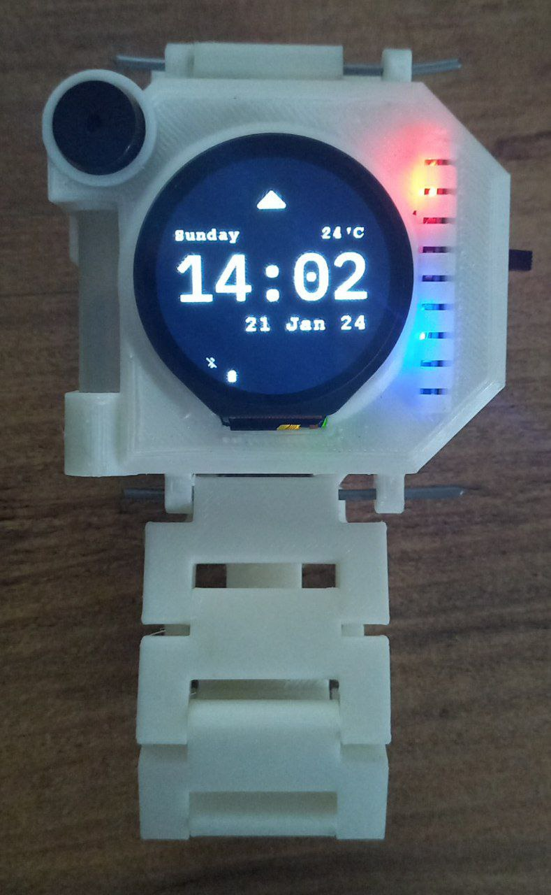

  <a href="https://github.com/umutsevdi/wear-pico">
  <h1 align="center">WearPico</h1>
  </a>

 
An open-source Smartwatch firmware written in C for the Raspberry Pi Pico.
   
    <i>Developed by <a href="https://github.com/umutsevdi">Umut Sevdi</a></i>

  

<a href="https://github.com/umutsevdi/wear-pico/wiki/">
<strong> Explore the docs » </strong></a>

<a href="Paper.pdf"><strong>Read the paper »
</strong></a>

Click [here](https://github.com/umutsevdi/wear-pico-app) to visit the
repository of the
mobile application.

## Project Definition

Wearable technologies are becoming increasingly important in today’s world.
Among them, smartwatches are the most widely accepted technology among
consumers.

Within the scope of the project, I developed a smartwatch and an associated
Android application that communicates with it. The smartwatch is designed as an
embedded system without a full-fledged operating system. In addition to
essential clock
functions such as time, alarm, and stopwatch, the smartwatch will have features
such
as receiving notifications, handling calls, and controlling the media player on
the phone. The touchscreen-operated watch will also include an accelerometer, a
buzzer for alarm sounds, and a motor for vibration.

On the mobile side, a mobile application can respond to requests and
messages sent by the smartwatch via Bluetooth. The application allows users to
set
alarms on the smartwatch and will manage background services such as
notifications, calls, and media controls using Android services.

https://github.com/umutsevdi/wear-pico/assets/20924548/dcb3c1bb-cdcc-4bc2-9a95-e2a301833b03

## Features
The WearPico is designed as an
embedded system without a full-fledged operating system. In addition to basic
clock functions such as time, alarm, and stopwatch, the smartwatch will have
features such as receiving notifications, handling calls, and controlling the
media player on the phone. The touchscreen-operated watch will also include
an accelerometer, a buzzer for alarm sounds, and a motor for vibration.

As of 2024, the project supports the following features:

* Fitness tracking
* Call Management
* Notifications
* Music and media control
* Reminder
* Alarms
* Lock Screen
* Temperature
* Touch Gestures
* Stopwatch
* Calendar
* Notepad
* Remote Configuration

**Alarm Demo**

https://github.com/umutsevdi/wear-pico/assets/20924548/749df7a0-29a2-42e6-b483-619b78cc841c

**Media Player Demo**

https://github.com/umutsevdi/wear-pico/assets/20924548/ea77b88b-3dda-47ed-8ad5-add205f5a800

## Installation
See [Installation](https://github.com/umutsevdi/wear-pico/wiki/Installation)

## Learn More
See [wiki](https://github.com/umutsevdi/wear-pico/wiki) to learn more.

## License

Distributed under the [GPL License](LICENSE).

## Contact

You can contact any developer of this project for any suggestions or
information.

Projects:
* [umutsevdi/wear-pico](https://github.com/umutsevdi/wear-pico)
* [umutsevdi/wear-pico-app](https://github.com/umutsevdi/wear-pico-app)

<i>Developed by <a href="https://github.com/umutsevdi">Umut Sevdi</a>

<i>Smartwatch case is designed and printed by
<a href="https://github.com/KozhaAkhmet">Kozha Akhmet Abrdamanov</a></i>.
